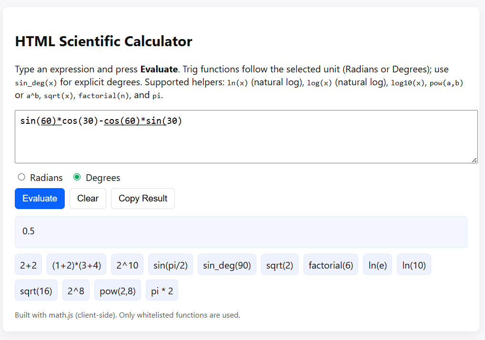

# 🧮 HTML Scientific Calculator

A responsive and interactive Scientific Calculator built using HTML, CSS, and JavaScript with the help of the math.js library.

This project supports arithmetic operations, trigonometric functions, logarithms, powers, factorials, and more through a clean and beginner-friendly interface.

---

## ✨ Features

- Basic arithmetic operations
- Scientific calculations
- Trigonometric functions
- Degree & Radian modes
- Square root and powers
- Logarithmic functions
- Factorials
- Copy result functionality
- Interactive example expressions
- Responsive modern UI
- Error handling for invalid expressions

---

## 🛠️ Technologies Used

- HTML5
- CSS3
- JavaScript (ES6)
- math.js Library

---

## 📌 Supported Functions

| Function | Example |
|---|---|
| Addition | `2 + 2` |
| Power | `2^10` |
| Square Root | `sqrt(16)` |
| Trigonometry | `sin(pi/2)` |
| Degree Trigonometry | `sin_deg(90)` |
| Factorial | `factorial(6)` |
| Logarithm | `log(10)` |
| Natural Log | `ln(e)` |
| Power Function | `pow(2,8)` |

---

## 📁 Project Structure

```bash
html-scientific-calculator/
│
├── index.html
├── Screenshot.png
└── README.md
```

---

## 🚀 How to Run the Project

### Method 1: Open Directly in Browser

1. Clone this repository

```bash
git clone https://github.com/Priyanka-2104/html-scientific-calculator.git
```

2. Open the project folder

3. Double-click `index.html`

The calculator will open in your browser.

---

### Method 2: Run Using VS Code Live Server

1. Open the project folder in VS Code

2. Install the Live Server extension in Visual Studio Code

3. Right-click on `index.html`

4. Click **"Open with Live Server"**

---

## 📸 Screenshot



---

## 🔮 Future Improvements

- Dark mode
- Calculation history
- Keyboard-only support
- Graph plotting
- Advanced scientific functions
- Better mobile responsiveness

---

## 📚 Learning Outcomes

This project helped in understanding:

- DOM Manipulation
- Event Handling
- JavaScript Functions
- External Library Integration
- Responsive Web Design
- Error Handling
- Frontend Development Basics
